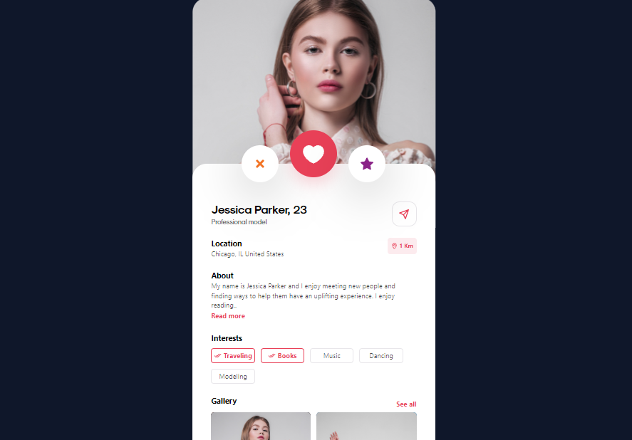

# Different Roads technical test

This project is made with Vite and Tailwind CSS

## Demo

[https://dr-technical-test.vercel.app/](https://dr-technical-test.vercel.app/)

## Local development

1. Clone the repository
2. Open a console in the repository folder
3. Run `npm install`
4. Finally, execute `npm run dev`
5. Go to `localhost:3000`  in your browser

## Screenshot

  
  

